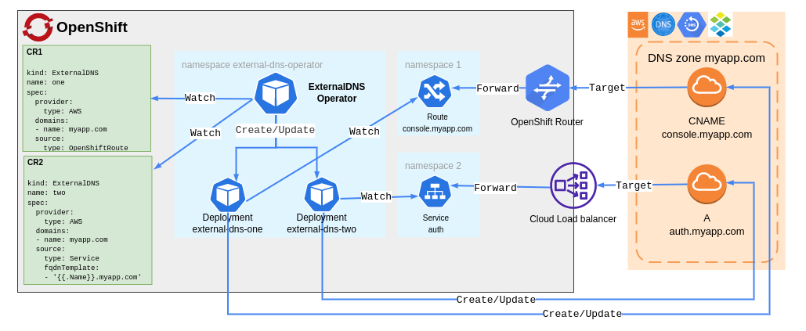

# OpenShift

This document provides information about how to use the `ExternalDNS Operator` in OpenShift Container Platform.

## How it works


## TLS certificates for validating webhook
Use the following convenience script to secure communication between the API and the Operator webhook: [add-serving-cert.sh](../hack/add-serving-cert.sh).
```bash
$ ./hack/add-serving-cert.sh --namespace external-dns-operator --service webhook-service --webhook validating-webhook-configuration --secret webhook-server-cert
```

## Release-branch mapping
| OCP version | ExternalDNS Operator branch |
| :---------: | :-------------------------: |
| 4.12        | release-1.1                 |
| 4.11        | release-1.0                 |
| 4.10        | release-0.1                 |

**Notes**:
- The table gets updated after every new release, when the release branch is already created.
- The same mapping is applicable for [external-dns repository](https://github.com/openshift/external-dns).
