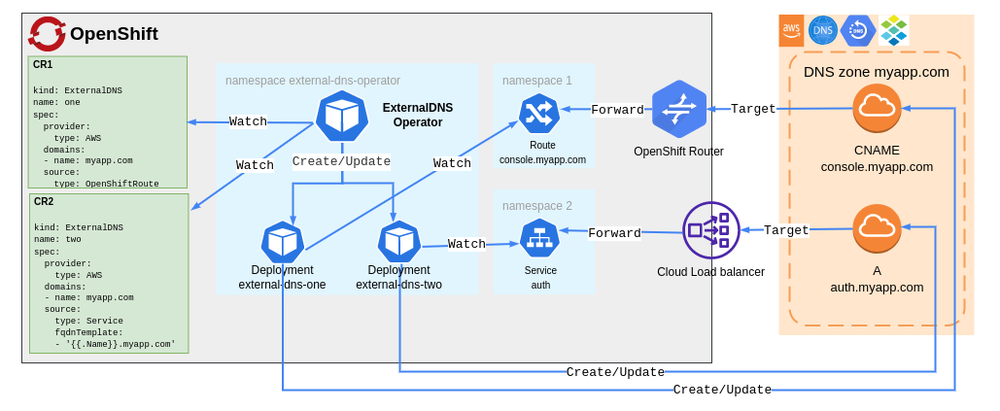

# OpenShift

This document provides information about how to use the `ExternalDNS Operator` in OpenShift Container Platform.

## How it works


## TLS certificates for validating webhook
Use the following convenience script to secure communication between the API and the Operator webhook: [add-serving-cert.sh](../hack/add-serving-cert.sh).
```bash
$ ./hack/add-serving-cert.sh --namespace external-dns-operator --service webhook-service --webhook validating-webhook-configuration --secret webhook-server-cert
```

## Operand metrics

Each ExternalDNS operand deployment includes a [kube-rbac-proxy](https://github.com/brancz/kube-rbac-proxy) sidecar per zone container to expose metrics over HTTPS. A `Service` and `ServiceMonitor` are created per `ExternalDNS` CR for Prometheus discovery.

### Multi-zone metric differentiation

When an `ExternalDNS` instance manages multiple zones, one ExternalDNS container runs per zone — each exposing the same metric names. Metrics are kept separate (not combined or deduplicated) through the following mechanism:

- Each zone container binds its metrics to a distinct localhost port (`:7979`, `:7980`, etc.).
- Each kube-rbac-proxy sidecar proxies one of those ports on a distinct secure port (`:9091`, `:9092`, etc.).
- The `ServiceMonitor` creates one endpoint entry per port.
- Prometheus assigns a unique `instance` label (`pod_ip:port`) to each scrape target.

This means metrics from different zones within the same `ExternalDNS` instance are differentiated by port via the `instance` label. Metrics from different `ExternalDNS` instances are differentiated by pod or deployment name.
